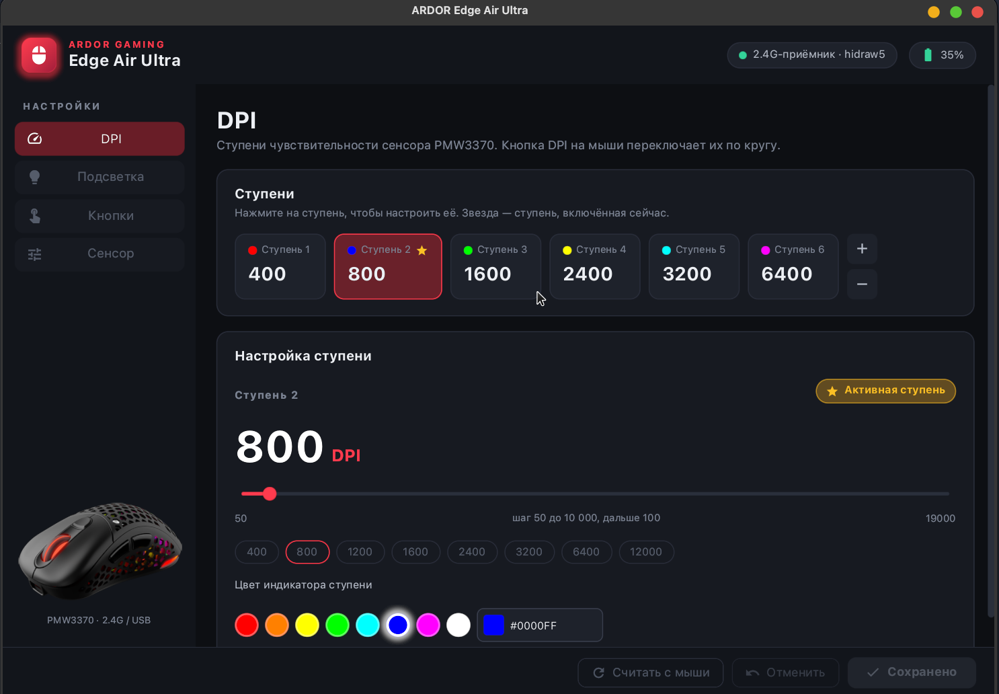
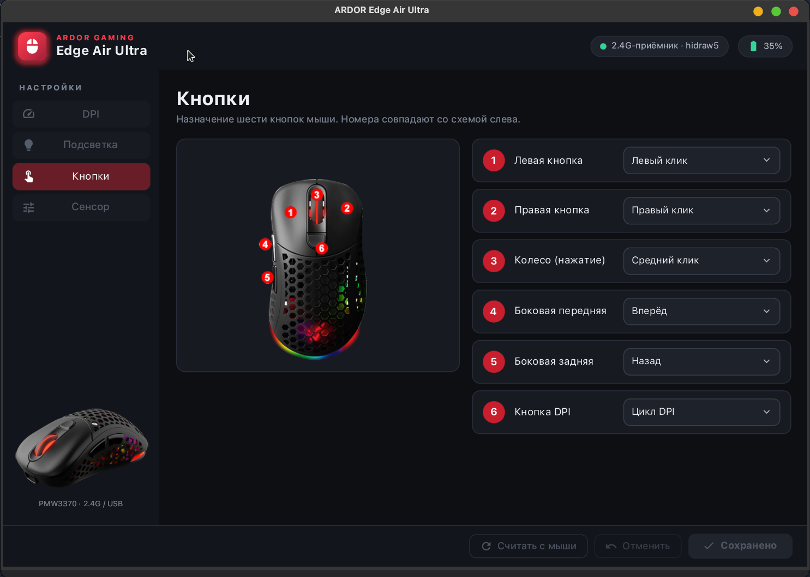
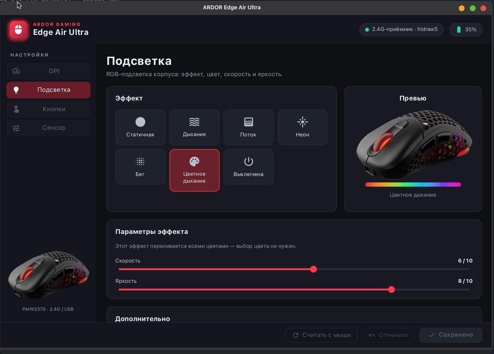
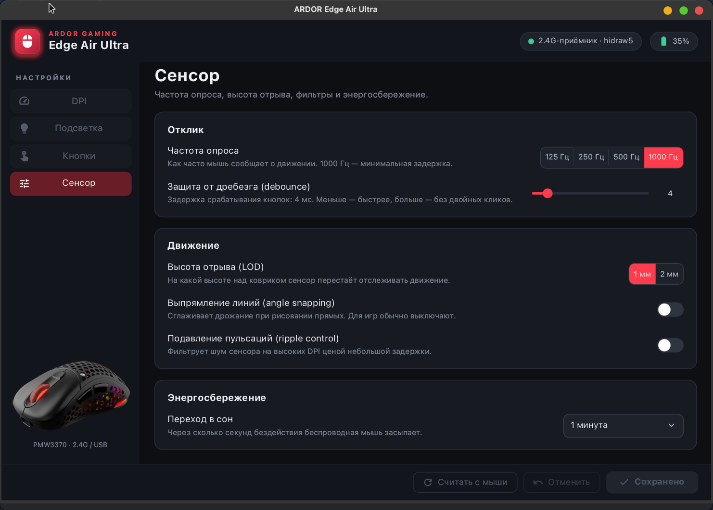

# ardor-mouse

A native Linux configuration tool for the **ARDOR GAMING Edge Air Ultra** wireless mouse —
a replacement for the vendor's Windows-only `OemDrv.exe`.

The vendor ships no Linux software and publishes no protocol. Everything here was
reverse-engineered: the Windows utility was disassembled, its USB traffic compared against a
live mouse, and every EEPROM field verified on real dumps. Written in Rust on
[syngui](https://github.com/VitaminDB/syngui); talks to the mouse directly through `hidraw` —
no kernel module, no daemon, no root.



| Lighting | Buttons | Sensor |
|---|---|---|
|  |  |  |

> The interface is in Russian for now.

## What it does

- **DPI** — up to 8 stages from 50 to 19 000 DPI, each with its own indicator color;
  choose the active stage.
- **RGB lighting** — 7 effects (static, breathing, flow, neon, marquee, color breathing, off),
  color, speed and brightness, with a live preview.
- **Buttons** — remap all 6 buttons: clicks, back/forward, DPI cycle / up / down, disable.
- **Sensor** — polling rate 125/250/500/1000 Hz, lift-off distance 1/2 mm, debounce,
  angle snapping, ripple control, sleep timeout.
- **Battery** level and charging state.

Settings are read from the mouse's own memory and only the changed regions are written back,
so the tool never overwrites what it does not understand.

## Supported hardware

| Device | USB ID |
|---|---|
| Edge Air Ultra, 2.4 GHz receiver | `25a7:fa7c` |
| Edge Air Ultra, USB cable | `25a7:fa7b` |

Sensor PixArt PMW3370, JM03 (Compx) controller. Other mice on the same controller may speak
the same protocol, but only the Edge Air Ultra has been tested.

## Install

### Arch Linux (AUR)

```bash
yay -S ardor-mouse        # or paru -S ardor-mouse
```

The package installs `/usr/bin/ardor-mouse`, a menu entry, icons and a udev rule that gives
the logged-in user access to the mouse. If the receiver was already plugged in, replug it once.

### From source

Requires a recent stable Rust and the usual graphics stack (Vulkan or GL driver, Wayland or X11).

```bash
git clone https://github.com/VitaminDB/ardor-mouse
cd ardor-mouse
cargo build --release
sudo install -Dm644 packaging/70-ardor-mouse.rules /etc/udev/rules.d/70-ardor-mouse.rules
sudo udevadm control --reload-rules && sudo udevadm trigger
./target/release/ardor_mouse
```

The udev rule tags the mouse's `/dev/hidraw*` nodes with `uaccess`, so no `sudo` is needed to
run the app.

## Usage

```bash
ardor-mouse                 # configure the connected mouse
ardor-mouse --simulate      # demo mode with a simulated mouse — no hardware needed
ARDOR_TRACE=1 ardor-mouse   # print every packet exchanged with the mouse to stderr
```

If the mouse is asleep, the receiver answers but the mouse memory is unreachable — move the
mouse and the settings load by themselves.

## Protocol

For anyone porting this to another tool or another mouse on the same controller.

- The receiver exposes two HID interfaces with the same VID/PID. `:1.0` is the ordinary mouse;
  the command interface is `:1.1`, recognised by feature report `0x08` in its report descriptor.
- **Request** — feature report `0x08`, 17 bytes, sent with `ioctl(HIDIOCSFEATURE(17))`:

  ```text
  [08] [cmd] [00] [addr_hi] [addr_lo] [len] [data × 10] [0x55 − Σ]
  ```

- **Response** — input report `0x09` in the same layout; byte `[2]` is the status (`0` = OK).
- **Commands** — `03` link status, `04` battery, `07` write EEPROM, `08` read EEPROM.
- **Profile EEPROM** (`0x00…0xB4`): polling rate, DPI count and active stage, lift-off
  distance, 8 DPI stages, 8 DPI colors, 16-entry button matrix, lighting block, debounce,
  sleep timeout, angle snapping, ripple control. The full map with value encodings is in
  [`src/protocol/eeprom.rs`](src/protocol/eeprom.rs).

## Project layout

```text
src/protocol/   packets and checksums, DPI, lighting, buttons, EEPROM map and settings model
src/transport/  hidraw (real device), sim (simulator), Device (commands)
src/worker.rs   background thread that talks to the mouse
src/ui/         the window: DPI, lighting, buttons, sensor pages
packaging/      udev rule, .desktop entry, PKGBUILD
```

`cargo test` runs 30 tests, including decoding of packets and EEPROM dumps captured from a
real mouse.

## Disclaimer

Unofficial project, not affiliated with or endorsed by ARDOR GAMING. "ARDOR GAMING" and
"Edge Air Ultra" are trademarks of their owners; the mouse images in `assets/skins/` are the
vendor's and are used only to label the buttons and lighting. Writing to the mouse EEPROM is
done the same way the vendor utility does it, but you use this tool at your own risk.

## License

[MIT](LICENSE)
