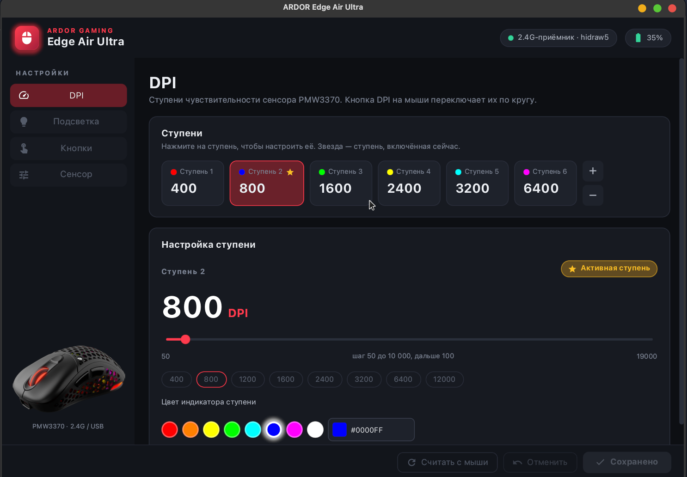
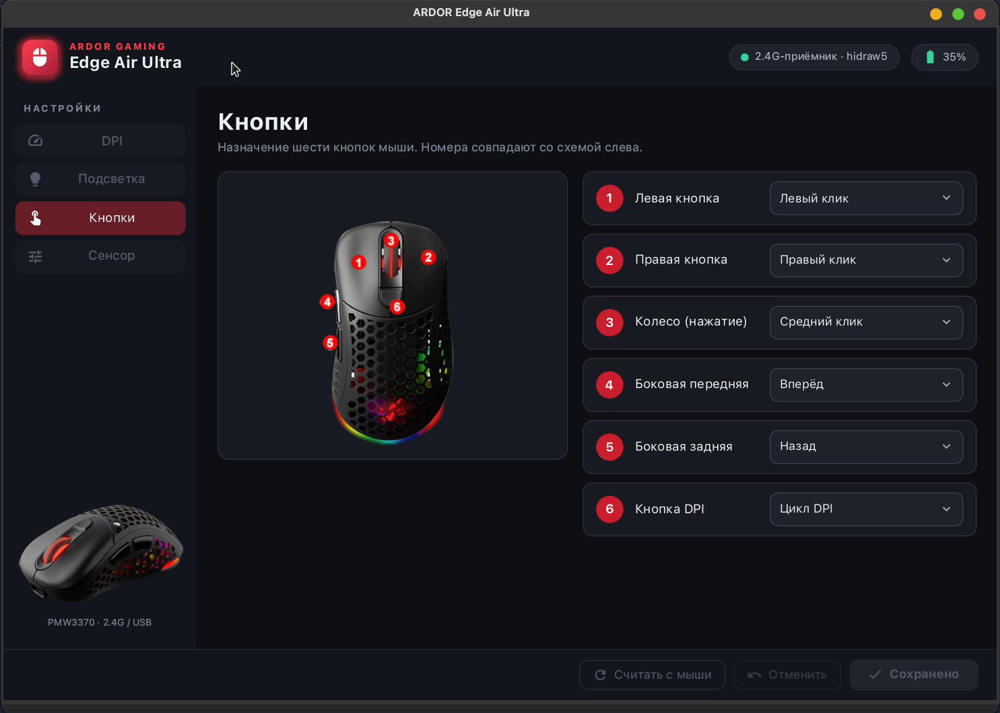
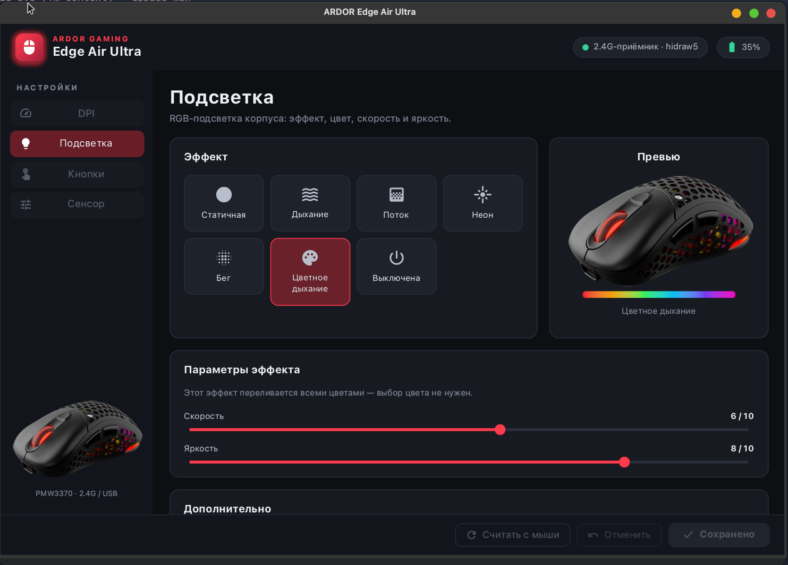
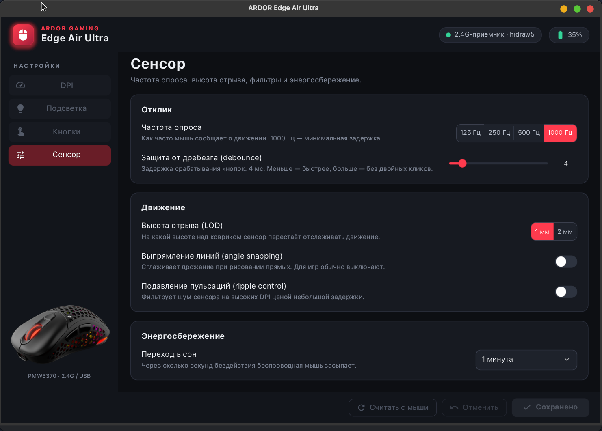

# ardor-mouse

[](#how-it-is-built)

A native Linux configuration tool for **ARDOR GAMING** wireless mice — the **Edge Air Ultra**
and the **Rukh** — a replacement for the vendor's Windows-only utilities.

The vendor ships no Linux software and publishes no protocol. Everything here was
reverse-engineered: the Windows utilities were disassembled / decompiled, their protocol
checked against live mice, and every EEPROM field verified on real dumps. Written in Rust on
[syngui](https://github.com/VitaminDB/syngui); talks to the mouse directly through `hidraw` —
no kernel module, no daemon, no root.



| Lighting | Buttons | Sensor |
|---|---|---|
|  |  |  |

> The interface is in Russian for now.

## What it does

- **DPI** — up to 8 stages from 50 to 19 000 DPI, each with its own indicator color;
  choose the active stage.
- **RGB lighting** — 7 effects (static, breathing, flow, neon, marquee, color breathing, off),
  color, speed and brightness, with a live preview.
- **Buttons** — remap all 6 buttons: clicks, back/forward, DPI cycle / up / down, disable.
  (RGB lighting is Edge Air Ultra only — the Rukh has no body lighting.)
- **Sensor** — polling rate 125/250/500/1000 Hz, lift-off distance 1/2 mm, debounce,
  angle snapping, ripple control, sleep timeout. On the Rukh also 2000 Hz, 0.7 mm lift-off,
  Motion Sync and the LP/HP sensor mode.
- **Battery** level and charging state.

Settings are read from the mouse's own memory and only the changed regions are written back,
so the tool never overwrites what it does not understand.

## Supported hardware

| Device | USB ID | Sensor | Status |
|---|---|---|---|
| Edge Air Ultra, 2.4 GHz receiver | `25a7:fa7c` | PMW3370, 50–19 000 DPI | tested |
| Edge Air Ultra, USB cable | `25a7:fa7b` | | tested |
| Rukh, 2.4 GHz receiver | `3554:f53e` | PAW3950, 50–30 000 DPI | read + write tested |
| Rukh, USB cable | `3554:f53d` | | not seen — the tested unit only charges over the cable |

Both mice use a Compx controller with the same command set and the same EEPROM map. Other
mice on the same controller may speak the same protocol, but only these have been tested.

## Install

### Arch Linux (AUR)

```bash
yay -S ardor-mouse        # or paru -S ardor-mouse
```

The package installs `/usr/bin/ardor-mouse`, a menu entry, icons and a udev rule that gives
the logged-in user access to the mouse. If the receiver was already plugged in, replug it once.

### From source

Requires a recent stable Rust and the usual graphics stack (Vulkan or GL driver, Wayland or X11).

```bash
git clone https://github.com/VitaminDB/ardor-mouse
cd ardor-mouse
cargo build --release
sudo install -Dm644 packaging/70-ardor-mouse.rules /etc/udev/rules.d/70-ardor-mouse.rules
sudo udevadm control --reload-rules && sudo udevadm trigger
./target/release/ardor_mouse
```

The udev rule tags the mouse's `/dev/hidraw*` nodes with `uaccess`, so no `sudo` is needed to
run the app.

## Usage

```bash
ardor-mouse                    # configure the connected mouse
ardor-mouse --simulate [rukh]  # demo mode with a simulated mouse — no hardware needed
ardor-mouse --read-only        # only read commands are sent; writing is impossible
ardor-mouse --dump FILE        # save the raw profile image read first (never overwrites FILE)
ARDOR_TRACE=1 ardor-mouse      # print every packet exchanged with the mouse to stderr
```

Trying a new mouse? Start with `--read-only --dump backup.bin`: you get a byte-exact backup of
its settings before anything is written.

If the mouse is asleep, the receiver answers but the mouse memory is unreachable — move the
mouse and the settings load by themselves.

## Protocol

For anyone porting this to another tool or another mouse on the same controller.

- The receiver exposes several HID interfaces with the same VID/PID; the command interface is
  `:1.1`, recognised by report `0x08` in its report descriptor.
- **Request** — report `0x08`, 17 bytes:

  ```text
  [08] [cmd] [00] [addr_hi] [addr_lo] [len] [data × 10] [0x55 − Σ]
  ```

  Edge Air Ultra: a *feature* report, sent with `ioctl(HIDIOCSFEATURE(17))`.
  Rukh: an *output* report, sent with `write()`.
- **Response** — same layout; byte `[2]` is the status (`0` = OK). Edge Air Ultra answers with
  input report `0x09`, Rukh with input report `0x08`. The Rukh also sends unsolicited `0x0A`
  "status changed" reports (bit 0 of data — DPI stage changed by the button).
- **Commands** — `03` link status, `04` battery, `07` write EEPROM, `08` read EEPROM.
- **Profile EEPROM** (`0x00…0xBF`): polling rate, DPI count and active stage, lift-off
  distance, 8 DPI stages, 8 DPI colors, 16-entry button matrix, lighting block, debounce,
  sleep timeout, angle snapping, ripple control. The full map with value encodings is in
  [`src/protocol/eeprom.rs`](src/protocol/eeprom.rs).
- **DPI stage** — `[code_x][code_y][flags][0x55 − Σ]`. PMW3370: 8-bit code plus a multiplier in
  `flags`. PAW3950: 10-bit code, `dpi = 50 · (code + 1)`, the top two bits in `flags`
  (bits 7–6 for X, 3–2 for Y). See [`src/protocol/dpi.rs`](src/protocol/dpi.rs).
- What differs between the supported mice is collected in
  [`src/protocol/model.rs`](src/protocol/model.rs).

## Project layout

```text
src/protocol/   packets and checksums, supported models, DPI, lighting, buttons, EEPROM map
src/transport/  hidraw (real device), sim (simulator), Device (commands)
src/worker.rs   background thread that talks to the mouse
src/ui/         the window: DPI, lighting, buttons, sensor pages
packaging/      udev rule, .desktop entry, PKGBUILD
```

`cargo test` runs 50 tests, including decoding of packets and EEPROM dumps captured from real
Edge Air Ultra and Rukh mice.

## How it is built

This project is vibe-coded. Since spring 2026 I write all of my projects with [Claude
Code](https://claude.com/claude-code): I decide what to build and how it fits together,
describe each task, and review, run and measure the result on my own hardware — the model
writes the code, the tests and most of the documentation. The protocol was reverse-engineered
from and tested on my own mouse.

## Disclaimer

Unofficial project, not affiliated with or endorsed by ARDOR GAMING. "ARDOR GAMING",
"Edge Air Ultra" and "Rukh" are trademarks of their owners; the mouse images in
`assets/skins/` are the vendor's and are used only to label the buttons and lighting. Writing
to the mouse EEPROM is done the same way the vendor utilities do it, but you use this tool at
your own risk.

## License

[MIT](LICENSE)
